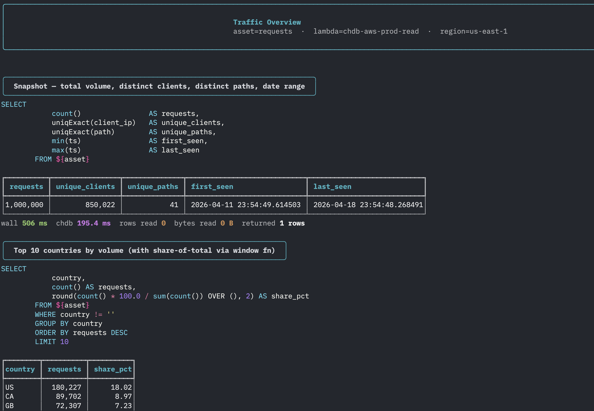
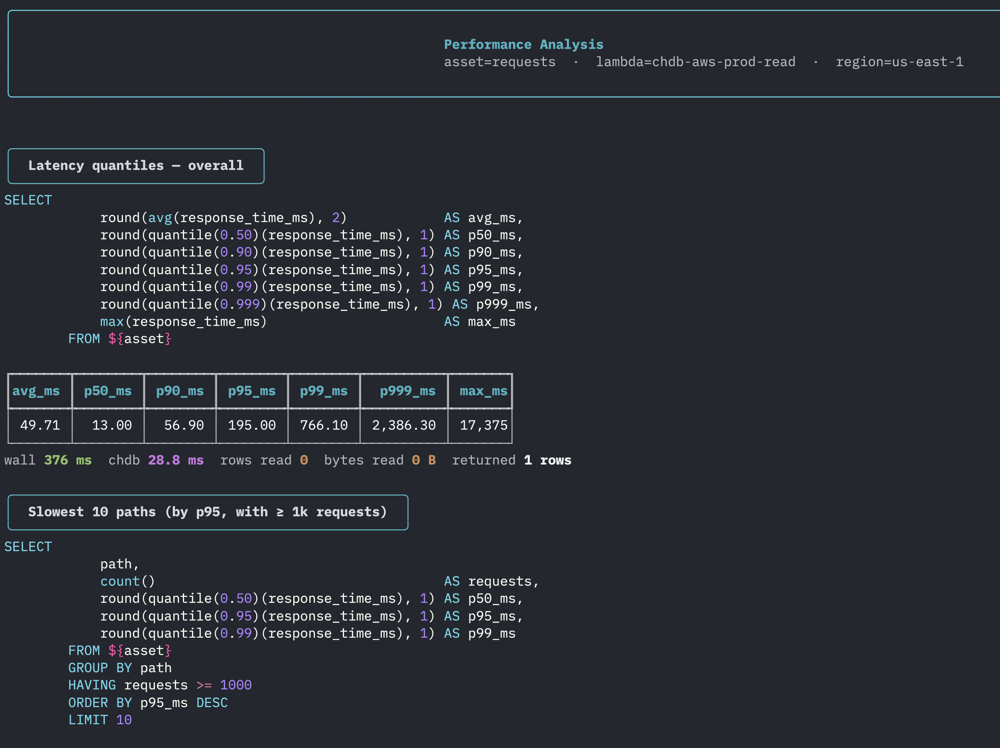
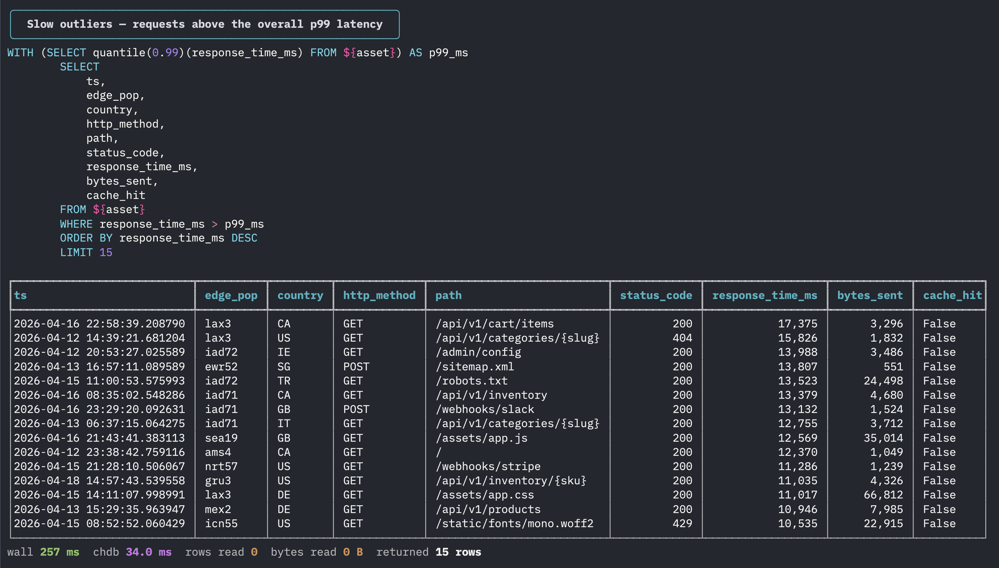

# Demo — CDN edge logs on chDB + S3 Tables

A self-contained demo that loads ~1 million synthetic CDN-edge request rows into the `requests` Iceberg table and queries them through the read Lambda with chDB. Built to be screenshot-friendly: every script prints with `rich` (panels, syntax-highlighted SQL, result tables, per-query timing line, run summary).

## What's here

| Script | What it does |
|---|---|
| `populate.py` | Generates N rows of realistic CDN logs in B parquet batches, drops them in the dropzone, and polls each batch through to the archive prefix so the progress bar reflects real ingestion. |
| `query_traffic.py` | Volume / geography / time / POP mix. Demonstrates `uniqExact`, top-K, hourly bucketing, window functions for share-of-total. |
| `query_performance.py` | Latency quantiles / slow paths / cache lift / response-size histogram. Demonstrates `quantile(...)`, `multiIf`-labelled boolean grouping, conditional averages. |
| `query_anomalies.py` | 5xx trends / offender IPs / p99 outliers / bot regex. Demonstrates `countIf`, WITH-clause for thresholds, `match()` regex, multi-class segmentation. |
| `_helpers.py` | Shared. Auto-discovers Lambda function name + data bucket from `terraform -chdir=terraform/main output -json`. Renders results with `rich`. |

## Auto-discovery

You don't need to pass `--function-name` or `--data-bucket` — the helpers read the live values out of the main Terraform state. Override order: env var → `terraform output` → hardcoded fallback.

| Default | Env var override | Terraform output key |
|---|---|---|
| Lambda function name | `CHDB_READ_FUNCTION` | `read_lambda_function_name` |
| Data bucket | `CHDB_DATA_BUCKET` | `data_bucket_name` |
| Asset name | `CHDB_ASSET` | — (defaults to `requests`) |
| AWS region | `AWS_REGION` | — (defaults to `us-east-1`) |

So as long as `terraform apply` has been run on `terraform/main`, every script Just Works.

## One-time prerequisites

Bootstrap the tfstate bucket, deploy the main stack, and push the Lambda image. You only do this once per account+region.

```sh
# 1. tfstate backend
cd terraform/bootstrap
terraform init && terraform apply -auto-approve

# 2. main stack — phase 1 (creates ECR + tables, no lambda yet)
cd ../main
terraform init && terraform apply -auto-approve

# 3. build + push the Lambda container image
cd ../..
export AWS_ACCOUNT_ID=$(aws sts get-caller-identity --query Account --output text)
./scripts/build-image.sh
AWS_REGION=us-east-1 AWS_ACCOUNT_ID=$AWS_ACCOUNT_ID REPO_NAME=chdb-aws-prod TAG=latest \
    ./scripts/push-image.sh

# 4. main stack — phase 2 (adds lambdas + S3 notification)
cd terraform/main
terraform apply -auto-approve \
    -var "image_uri=$AWS_ACCOUNT_ID.dkr.ecr.us-east-1.amazonaws.com/chdb-aws-prod:latest"
cd ../..
```

After the second apply the outputs will show:

```
data_bucket_name           = "chdb-aws-prod-data"
read_lambda_function_name  = "chdb-aws-prod-read"
write_lambda_function_name = "chdb-aws-prod-write"
table_arns                 = { "requests" = "arn:aws:s3tables:..." }
```

## Run the demo (the part you screenshot)

Each command is independent and uses auto-discovered defaults.

### populate

```sh
uv run scripts/demo/populate.py --rows 1000000 --batches 10
```

Expect ~50 s for 1M rows on a fresh run. Output ends with a summary panel showing rows, MB uploaded, wall time, rows/s, and MB/s. **→ screenshot for `docs/screenshots/populate.png`**

Useful overrides:
- `--rows 5000000 --batches 50` for a bigger demo (~5 min, parquet hits a few hundred MB)
- `--no-wait` to skip the dropzone→archive polling (returns as soon as upload completes)

### query_traffic

```sh
uv run scripts/demo/query_traffic.py
```

4 queries: snapshot, top countries, hourly volume, top POPs. **→ screenshot for `docs/screenshots/traffic.png`**

The first query of the very first run pays a cold-Lambda + cold-cache cost (~10 s on a fresh container). Every subsequent query — same script, same snapshot — finishes in well under a second because the read Lambda caches the materialized parquet on `/tmp` keyed on the table's metadata location.

### query_performance

```sh
uv run scripts/demo/query_performance.py
```

4 queries: overall quantiles, slowest paths by p95, cache hit vs miss latency, response-size histogram by HTTP method. **→ screenshot for `docs/screenshots/performance.png`**

### query_anomalies

```sh
uv run scripts/demo/query_anomalies.py
```

4 queries: 15-minute error-rate buckets, top offender IPs, p99 outliers (via WITH clause), bot vs client-lib vs browser segmentation by user-agent regex. **→ screenshot for `docs/screenshots/anomalies.png`**

## Cold vs warm queries

There are three independent things that have to be "warm" for a query to feel snappy. Each one accounts for a chunk of the wall-clock time and the demo will hit a different mix of them depending on what just happened.

| Layer | What it is | Cost when cold | When it goes cold |
|---|---|---|---|
| Lambda container | AWS spins up a new container, loads the image (~1.2 GB), runs Python init, opens the pyiceberg REST catalog connection. | ~2–4 s of `INIT_REPORT` time you'll see in CloudWatch. | After ~15 min of no invocations, or any time AWS recycles the container. |
| `/tmp` parquet cache | The read Lambda materializes the entire current Iceberg snapshot to a local parquet file under `/tmp/chdb_cache_<hash>.parquet` and lets chDB query it via `file()`. | ~5–10 s for 1M rows: `pyiceberg.scan().to_arrow()` fetches manifests + data files from S3 Tables, then `pq.write_table` lands them on `/tmp`. | Two ways: the container is brand new (so `/tmp` is empty), or a new write has advanced the table's `metadata_location` (so the cache key changes — the old file is still on disk but no query asks for it). |
| chDB query itself | The actual SQL execution against the local parquet. | Tens to a few hundred ms even on cold disk. Almost never the bottleneck. | Per-query; not really cacheable here without sharing chDB sessions. |

The cache is keyed on `sha1(namespace + asset + metadata_location)` — see `src/chdb_aws/read/query.py:_cache_path`. That means new writes invalidate it automatically (a new snapshot has a new `metadata_location` → new key → new file written), but reads against an unchanged snapshot share one materialized parquet across every query that hits a warm container.

What that looks like in practice on the demo dataset:

| Scenario | First query in the script | Queries 2–4 |
|---|---|---|
| Right after `terraform apply` (cold container, cold cache) | **~10 s** (Lambda init + full scan + parquet write + chDB) | sub-second each (warm container, warm cache) |
| Right after `populate.py` re-ran (container still alive, but new snapshot → cache miss) | **~5–7 s** (no Lambda init, but new scan) | sub-second each (cache now warm for the new snapshot) |
| Steady state, no recent writes, container kept warm | **<500 ms** | sub-second each |

Lambda containers stay alive for roughly 15 minutes between invocations under typical load — but it's a soft AWS heuristic, not a guarantee. The first script you run after a coffee break will probably pay the container cost again.

If you ever need to see the cold path again, the easiest way is to update the Lambda's environment (or push a new image) — that forces AWS to spin up a fresh container.

## Why so fast?

Look at any warm row in the screenshots — `wall 268 ms / chdb 48 ms` for a top-K + cache-rate aggregation across a million rows. Three things make that possible:

1. **The Lambda container is already running.** No `INIT_REPORT`, no Python imports, no fresh pyiceberg REST connection. The whole `handler.handler` function is just a few lines on a long-lived process. Warm Lambda invokes have ~50–150 ms of fixed AWS-side dispatch overhead and that's it.

2. **The parquet is already on the container's local NVMe.** "Local" here means the same physical Lambda host the chDB process is running on — not your laptop. The first query in the snapshot ran `pyiceberg.scan().to_arrow()` (manifests + data files from S3 Tables → Arrow) and dumped a `~38 MB` zstd parquet to `/tmp/chdb_cache_<hash>.parquet`. The hash is `sha1(namespace + asset + metadata_location)`, so any new write yields a new key and the cache rebuilds; otherwise every later query in the same container hits an `os.path.exists()` instead of touching the network.

3. **chDB is just executing SQL against a local file.** This is ClickHouse's vectorized engine — SIMD over column batches, parquet's row-group statistics for pruning, only the columns mentioned in the SELECT get decoded. For 1M rows of CDN logs (a 4 MB `int32` column for `response_time_ms`, a ~10 MB `string` column for `country`, etc.), a `quantile + count + groupBy` is single-core CPU-bound at ~30–100 ms. That's the chDB column you see.

The wall-vs-chDB gap (e.g. `wall 268 / chdb 48` for the POPs query) is fixed-cost overhead, not query work:

| ms | what |
|---|---|
| 30–60 | `boto3 invoke` → SigV4 signing → AWS API routing |
| 50–100 | Lambda warm-invoke dispatch into your container |
| 50–150 | `pyiceberg.load_table()` — one HTTPS hop to the S3 Tables REST catalog to read the current `metadata_location` (paid every query so the cache key stays correct; could be elided with a short TTL) |
| 30–300 | chDB query against the local parquet — the only part that scales with data size |
| 20–50 | response payload back through Lambda → boto3 |

What is **not** happening on a warm query: no `S3:GetObject` for parquet data files, no `S3:ListObjects`, no remote query engine. The only network calls are your `boto3 invoke` round trip and one S3 Tables catalog lookup. Everything else is CPU + a local file.

## Tip — getting a "warm" run for screenshots

To capture clean sub-second runs, warm everything up once and discard the output, then capture the runs you want:

```sh
# warm the container + populate /tmp cache (cold-path run, ~10 s)
uv run scripts/demo/query_traffic.py >/dev/null

# now capture clean warm-path runs
uv run scripts/demo/query_traffic.py
uv run scripts/demo/query_performance.py
uv run scripts/demo/query_anomalies.py
```

Reference timings on a 1M-row dataset, 3008 MB Lambda, warm container, warm cache:

| Script | Total wall (4 queries) |
|---|---|
| `query_traffic.py` | ~1.4 s |
| `query_performance.py` | ~1.1 s |
| `query_anomalies.py` | ~1.8 s |

If you instead want to *show off the cold path* in a screenshot (it's part of the story too — it's where you'd typically advertise that even the cold case is "10 seconds for 1M rows from object storage"), force a new image push or just wait 15+ minutes between runs.

## Tearing down

`force_destroy = true` is set on the data bucket and ECR repo, so destroy is one shot:

```sh
cd terraform/main
# match whatever -var image_uri was used at apply time, or pass a dummy
terraform destroy -auto-approve \
    -var "image_uri=$AWS_ACCOUNT_ID.dkr.ecr.us-east-1.amazonaws.com/chdb-aws-prod:latest"
```

The tfstate bucket from `terraform/bootstrap` persists by design — it holds the main stack's state. Destroy it manually (`aws s3 rb s3://chdb-aws-tfstate --force`) if you really mean to wipe everything.

## Screenshots

Captured against 1,000,000 rows on a warm container + warm cache, 3008 MB Lambda, `us-east-1`.

### Traffic Overview — `query_traffic.py`

Volume snapshot, top countries with share-of-total via window function, hourly buckets, top edge POPs with cache-hit rate.



### Performance Analysis — `query_performance.py`

Latency quantile family (p50/p90/p95/p99/p999/max), slowest paths by p95, cache HIT vs MISS lift, response-size distribution by HTTP method.



### Error & Anomaly Detection — `query_anomalies.py`

15-minute error-rate buckets, top offender IPs by 4xx/5xx, p99 outliers via WITH-clause threshold, bot/client-lib/browser segmentation by user-agent regex.


